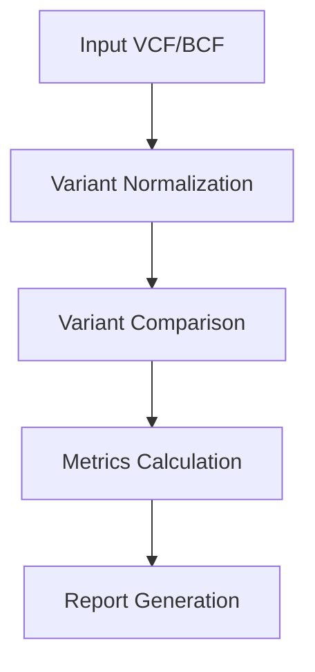

# hap.py Architecture

## Overview

This document provides a high-level overview of the hap.py architecture, focusing on the modern Python implementation. The architecture has been redesigned to improve maintainability, performance, and extensibility while maintaining compatibility with existing workflows.

## Core Components

### 1. Variant Processing Pipeline



### 2. Module Structure

```
src/hap_py/
├── __init__.py          # Package initialization
├── hap.py               # Main hap.py CLI entry point
├── pre.py               # Preprocessing CLI entry point
├── qfy.py               # Quantification CLI entry point
├── haplo/               # Core comparison logic and modules
│   ├── __init__.py
│   ├── cython_compat.py
│   ├── cython_mock.py
│   ├── cython_util.pyx
│   ├── gvcf2bed.py
│   ├── happyroc.py
│   ├── happyroc.pyx
│   ├── metrics_calculator.py
│   ├── partialcredit.py
│   ├── python_hapcmp.py
│   ├── python_preprocess.py
│   ├── python_quantify.py
│   ├── python_vcfcheck.py
│   ├── quantify_models.py
│   ├── quantify.py
│   ├── sequence_utils.py
│   ├── sequence_utils.pyx
│   ├── string_handling.py
│   ├── variant_processing.pyx
│   ├── variant_processor.py
│   ├── variant_processor.pyx
│   ├── vcf_analyzer.py
│   └── vcfeval.py
├── tools/               # Utility tools and helper functions
└── utils/               # General utilities
```

## Key Design Decisions

### 1. Modern Python Features

- **Type Hints**: Comprehensive type annotations for better IDE support and code reliability
- **Dataclasses**: Used for immutable data structures
- **Asynchronous I/O**: For improved performance with large files
- **Dependency Injection**: For better testability and modularity

### 2. Performance Optimizations

- **Caching**: Aggressive caching of expensive operations
- **Parallel Processing**: Utilizes Python's multiprocessing for CPU-bound tasks
- **Memory Efficiency**: Generators and iterators to handle large datasets
- **Cython Extensions**: Critical paths implemented in Cython for performance

### 3. Extensibility

- **Plugin System**: Easy to add new comparison methods and metrics
- **Modular Design**: Components can be used independently
- **Well-defined Interfaces**: Clear contracts between components

## Data Flow

1. **Input Phase**
   - Read and validate input VCF/BCF files
   - Parse and normalize variants
   - Load confident regions from BED file

2. **Comparison Phase**
   - Match variants between truth and query sets
   - Apply comparison logic (genotype-aware, position-based, etc.)
   - Calculate metrics for each comparison

3. **Output Phase**
   - Generate summary statistics
   - Create detailed reports
   - Optionally output annotated VCFs

## Threading Model

- **I/O Bound Operations**: Handled asynchronously
- **CPU Bound Operations**: Parallelized using process pools
- **Memory Sharing**: Minimized to reduce overhead
- **Thread Safety**: Critical sections properly synchronized

## Error Handling

- **Input Validation**: Comprehensive validation of all inputs
- **Graceful Degradation**: Continue processing on non-fatal errors
- **Detailed Logging**: Configurable logging for debugging
- **Resource Cleanup**: Proper cleanup of temporary files and resources

## Dependencies

### Core Dependencies

- **pysam**: For efficient VCF/BCF processing
- **numpy/pandas**: For numerical operations and data manipulation
- **cython**: For performance-critical sections
- **click**: For command-line interface

### Optional Dependencies

- **matplotlib/seaborn**: For visualization
- **rtg-tools**: For vcfeval engine
- **pytest**: For testing

## Performance Considerations

### Memory Usage

- **Chunked Processing**: Large files processed in chunks
- **Memory Mapping**: Used for large reference sequences
- **Efficient Data Structures**: Minimize memory overhead

### CPU Utilization

- **Parallel Processing**: Configurable number of worker processes
- **Vectorized Operations**: Using numpy for batch processing
- **Caching**: Avoid redundant computations

## Extension Points

### Adding a New Comparison Method

1. Create a new class implementing the `BaseComparator` interface
2. Register the comparator using the `@comparator` decorator
3. Implement the required comparison logic

### Adding a New Metric

1. Define the metric calculation function
2. Register it using the `@metric` decorator
3. Add any required configuration options

## Testing Strategy

- **Unit Tests**: Test individual components in isolation
- **Integration Tests**: Test the full pipeline
- **Performance Tests**: Monitor for regressions
- **Property-based Testing**: For complex logic

## Future Directions

- **Improved Parallelization**: Better scaling for multi-core systems
- **Streaming API**: For real-time variant comparison
- **Cloud Integration**: Native support for cloud storage
- **Enhanced Visualization**: Interactive reports and dashboards
- **Standardized Interfaces**: For better interoperability with other tools

## Contributing

See [CONTRIBUTING.md](CONTRIBUTING.md) for guidelines on contributing to the project.

## License

This project is licensed under the BSD 3-Clause License - see the [LICENSE.txt](LICENSE.txt) file for details.
