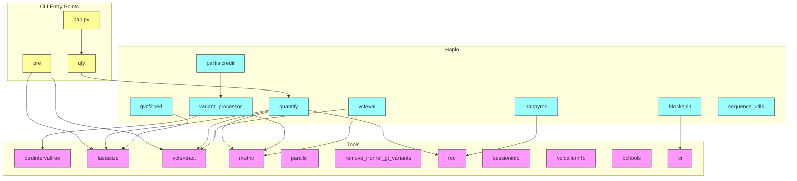

# Codebase Structure Overview

This document provides a high-level overview of the `happy` codebase modular structure:
pure-Python core modules in `src/python/Tools`, benchmarking logic in `src/python/Haplo`,
and CLI entry points in `src/python/happy`.

## Module Summaries

### Tools Modules (`src/python/Tools`)
- **bedintervaltree**: `BedIntervalTree` for interval lookups (used by variant stratification).
- **fastasize**: `fastaContigLengths`, `fastaSampleRegions` for FASTA indexing and sampling.
- **vcfextract**: header and variant extraction utilities (`extract_header`, `extract_variants`).
- **metric**: conversion between dataframes and metrics, table generators.
- **parallel**: parallel execution helpers.
- **remove_nonref_gt_variants**: filter `<NON_REF>` genotype records.
- **roc**: ROC curve generation for variant calling metrics.
- **sessioninfo**: capture session metadata (system, program arguments).
- **vcfcallerinfo**: parse and represent caller-specific INFO fields.
- **bcftools**, **ci**: wrappers around subprocess calls for external tools.

### Haplo Modules (`src/python/Haplo`)
- **quantify**: main quantification engine coordinating variant comparison.
- **variant_processor**: parses and processes VCF records into haplotype sequences.
- **vcfeval**: integrated wrapper for alternative vcfeval engine.
- **partialcredit**: handling partial matches in complex regions.
- **happyroc**: post-processing for ROC tables.
- **blocksplit**, **gvcf2bed**: utilities for gVCF to BED conversions and block splitting.
- **sequence_utils**: low-level sequence operations (reverse complement, alignment helpers).

### CLI Entry Points (`src/python/happy`)
- **hap.py**: invokes `qfy.quantify` with parsed CLI arguments.
- **qfy**: sets up quantification parameters, calls `Haplo.quantify.run_quantify`.
- **pre**: preprocessing pipeline for VCF normalization (leverages `vcfextract`, `fastasize`).

## Next Steps

Use this map to:
- Identify performance-critical modules (e.g., `variant_processor`, `vcfextract`).
- Track type-annotation targets and simplify inter-module dependencies.
- Plan microbenchmark coverage for each core module.
