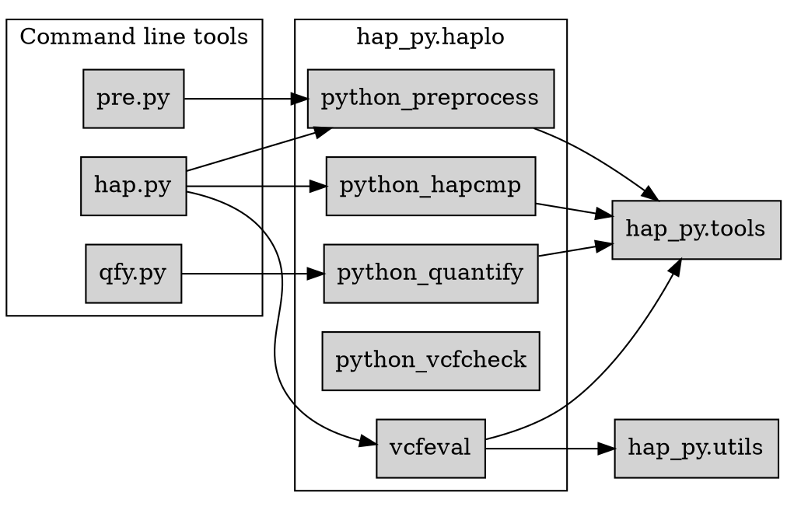

# Package Architecture

This diagram illustrates how the top-level command line interfaces rely on the core modules under `hap_py.haplo`, which in turn use helper functions in `hap_py.tools` and `hap_py.utils`.
